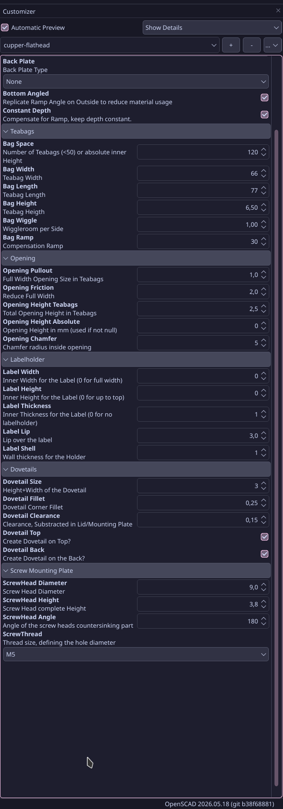

# Teabag Dispenser

Organizes all your teabags in a nice dispenser with fully parametric dimensions,
mountable on the top or back

## Usage

Open the `teabag.scad` in a recent (see below) OpenSCAD version.

### Parameters

Completely parametric design, you can adjust nearly all dimensions and parameters to create the version that fits your needs.

No sanity check is done, you can end up with too long features that overlap and make usage impossible.
If you want to fuck up, I'm not gonna stop you.

Examples:

|  |  |
| --- | --- |
| Rendered front view, with top mounting Lid and empty dovetail on the back | Rendered back view, with holder on the back and plain lid on the top. |

If you can't see the parameters, open the Customizer window at `OpenSCAD -> Window -> Customizer`

## OpenSCAD

### Version

The current stable does not work. Use a [OpenSCAD development snapshot](https://openscad.org/downloads.html#snapshots) from at least October 2025.

### Settings
- Edit -> Preferences -> Advanced -> 3D Rendering -> Backend -> Manifold (New/Fast)
